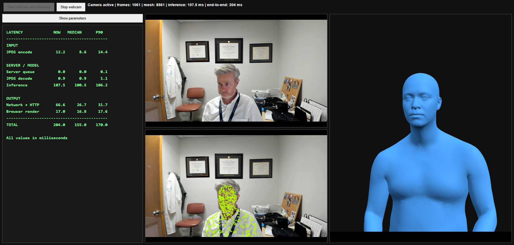

# Fast SAM 3D Body Webcam Demo

Live browser webcam inference using Fast SAM 3D Body on a remote NVIDIA GPU server.



## Overview

```text
Browser webcam
  -> JPEG frame over WebSocket
  -> Coder forwarded port
  -> persistent Fast SAM 3D Body estimator
  -> binary float32 mesh vertices
  -> projected overlay and interactive 3D rendering
```

The interface provides:

- Live webcam video
- Camera-aligned mesh overlay
- Independent interactive 3D mesh
- Runtime inference controls
- Current, median, and P90 latency measurements

## Upstream repository

This demo runs inside a working checkout of:

[Fast SAM 3D Body](https://github.com/yangtiming/Fast-SAM-3D-Body)

Project page:

[Fast SAM 3D Body project page](https://yangtiming.github.io/Fast-SAM-3D-Body-Page/)

## Requirements

The tested environment uses:

- Python 3.11
- PyTorch 2.5.1 with CUDA 12.4
- Detectron2 0.6
- MoGe2
- Ultralytics
- Flask
- flask-sock
- OpenCV
- NumPy
- NVIDIA RTX A6000

The Fast SAM 3D Body checkpoint must exist at:

```text
checkpoints/sam-3d-body-dinov3/model.ckpt
checkpoints/sam-3d-body-dinov3/assets/mhr_model.pt
```

The default pose detector is:

```text
checkpoints/yolo/yolo11m-pose.pt
```

The model repository is gated on Hugging Face. Access approval and Hugging Face authentication are required before downloading the checkpoint.

## Installation

Clone the upstream repository:

```bash
git clone https://github.com/yangtiming/Fast-SAM-3D-Body.git
cd Fast-SAM-3D-Body
```

Activate the Conda environment:

```bash
source "$HOME/miniconda3/etc/profile.d/conda.sh"
conda activate fast_sam_3d_body
```

Install the web dependencies into the active environment:

```bash
python -m pip install Flask flask-sock
```

Copy these files into the Fast SAM 3D Body repository root:

```text
webcam_server.py
webcam.html
```

## Model files

Authenticate to Hugging Face:

```bash
hf auth login
```

The required local directory should contain:

```text
checkpoints/
└── sam-3d-body-dinov3/
    ├── model.ckpt
    ├── model_config.yaml
    └── assets/
        └── mhr_model.pt
```

Download the YOLO11m-Pose detector if necessary:

```bash
python -c "from ultralytics import YOLO; YOLO('checkpoints/yolo/yolo11m-pose.pt')"
```

## EGL requirement

Headless rendering imports require the generic EGL loader.

On Ubuntu 24.04:

```bash
sudo apt-get install --reinstall libegl1
```

Verify EGL:

```bash
ldconfig -p 2>/dev/null | grep -E 'libEGL(\.so|_nvidia)'
```

Expected libraries include:

```text
libEGL.so.1
libEGL_nvidia.so.0
```

## Start the server

Activate the environment:

```bash
source "$HOME/miniconda3/etc/profile.d/conda.sh"
conda activate fast_sam_3d_body
```

Start the persistent inference server:

```bash
OMP_NUM_THREADS=8 \
MKL_NUM_THREADS=8 \
CUDA_VISIBLE_DEVICES=0 \
TRITON_PTXAS_PATH="$CONDA_PREFIX/bin/ptxas" \
FOV_MODEL=s \
FOV_LEVEL=0 \
FOV_SIZE=512 \
FOV_FAST=1 \
FOV_TRT=0 \
USE_COMPILE=1 \
USE_COMPILE_BACKBONE=1 \
DECODER_COMPILE=1 \
COMPILE_MODE=reduce-overhead \
COMPILE_WARMUP_BATCH_SIZES=1 \
MHR_USE_CUDA_GRAPH=0 \
GPU_HAND_PREP=1 \
SKIP_KEYPOINT_PROMPT=1 \
KEYPOINT_PROMPT_INTERM_INTERVAL=999 \
BODY_INTERM_PRED_LAYERS=0,1,2 \
HAND_INTERM_PRED_LAYERS=0,1 \
MHR_NO_CORRECTIVES=1 \
python webcam_server.py
```

Wait for:

```text
ESTIMATOR_READY vertices=18439 faces=36874
```

The first use of a new compiled inference path may be much slower than steady-state execution.

## Triton and CUDA

The tested host exposed CUDA 13.2, while the Conda environment contained CUDA 12.4 and Triton 3.1.0.

The following setting forces Triton to use the compatible Conda CUDA assembler:

```bash
TRITON_PTXAS_PATH="$CONDA_PREFIX/bin/ptxas"
```

Verify the selected assembler:

```bash
TRITON_PTXAS_PATH="$CONDA_PREFIX/bin/ptxas" \
python -c "from triton.backends.nvidia.compiler import _path_to_binary; print(_path_to_binary('ptxas'))"
```

Expected result:

```text
(<conda-environment>/bin/ptxas, 12.4)
```

## Coder port forwarding

The server listens on:

```text
0.0.0.0:8097
```

Configure Coder to forward server port `8097`.

The tested local browser address was:

```text
http://localhost:8098/
```

Open the page, then select **Start webcam and inference**.

## Runtime controls

### Inference mode

- **Body only:** lowest latency
- **Full body + hands:** processes body and hand crops

The first use of each mode may trigger additional `torch.compile` work.

### Camera intrinsics

- **Fixed calibrated median:** calibrates focal length and reuses the median
- **Dynamic MoGe per frame:** estimates focal length for every frame

The tested calibration window is 30 valid frames.

### Independent 3D view

- **Lock 3D center:** frames the mesh once and avoids visible center jitter
- **Reset 3D camera:** recalculates the initial framing
- Mouse drag rotates the mesh
- Mouse wheel zooms the mesh

Locking the independent view does not smooth or modify the predicted vertices.

### Overlay controls

- Show or hide the projected overlay
- Select dense, medium, or sparse topology
- Adjust opacity
- Adjust line width

The overlay uses predicted camera translation and focal length to project the mesh into webcam coordinates.

## Latency HUD

The HUD displays non-overlapping latency components:

```text
JPEG encode
Server queue
JPEG decode
Inference
Network + HTTP
Browser render
TOTAL
```

Each component reports:

- Current value
- Rolling median
- Rolling P90

All values are milliseconds.

## Observed performance

Observed on an NVIDIA RTX A6000 after compilation and focal calibration:

```text
Body-only inference at 448 or 512 input: approximately 75-100 ms
End-to-end latency: approximately 140-170 ms
```

Full body plus hands was slower in the tested configuration.

Results vary with:

- GPU contention
- Subject count
- Inference mode
- Model input size
- Compilation state
- Browser workload
- Overlay density

These values are deployment observations, not guaranteed benchmarks.

## Architecture notes

- The estimator is loaded once and reused.
- Frames and meshes use a persistent WebSocket connection.
- JPEG frames are transferred as binary data.
- Mesh vertices are returned as little-endian float32 values.
- Mesh topology is transferred once.
- The browser updates an existing Three.js geometry buffer.
- The server does not reload the model for each frame.
- OpenMP and MKL are limited to eight threads to prevent CPU oversubscription.
- Fixed median intrinsics remove repeated MoGe execution.
- Body-only mode avoids the two additional hand crops used by full mode.
- The independent mesh can use a fixed center without temporal smoothing.

## Troubleshooting

### First inference times out

A new `torch.compile` graph may take substantially longer on first use. Increase the WebSocket inference timeout and retry after compilation completes.

### `Unable to load EGL library`

Reinstall the generic EGL loader:

```bash
sudo apt-get install --reinstall libegl1
```

### Triton reports an unsupported CUDA version

Force Triton to use the Conda CUDA 12.4 assembler:

```bash
export TRITON_PTXAS_PATH="$CONDA_PREFIX/bin/ptxas"
```

### `ModuleNotFoundError: flask_sock`

Install flask-sock with the active Conda Python:

```bash
python -m pip install flask-sock
```

### High or variable preprocessing latency

Confirm the thread limits are active:

```bash
export OMP_NUM_THREADS=8
export MKL_NUM_THREADS=8
```

The uncapped environment used 128 intra-op and 128 inter-op threads and produced substantially higher latency.

## Privacy

Webcam frames are transmitted to the configured GPU server for inference.

Before using identifiable, clinical, research, or otherwise sensitive video, confirm that the server, browser connection, storage behavior, and network path comply with applicable institutional privacy and data-handling requirements.
